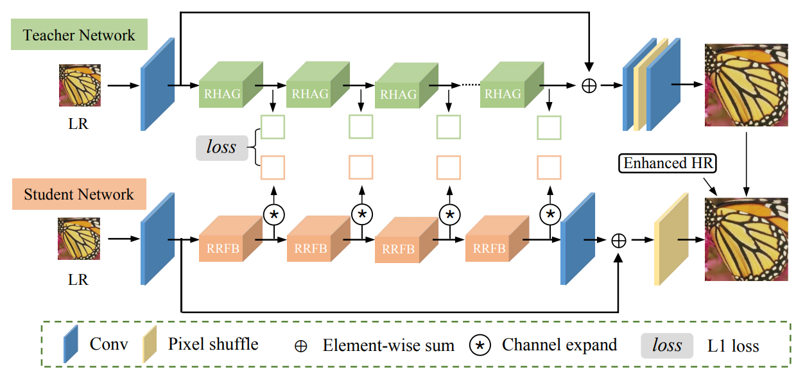
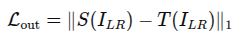
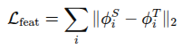

## Knowlegde distillation

In this project, we apply Knowledge Distillation (KD) to enhance the performance of the lightweight DIPNet model by transferring knowledge from a high-capacity Transformer-based teacher model (e.g., HAT, SwinIR).

### ⚙️ Distillation Strategy

We implement a **two-phase KD pipeline**:

#### 1. Output Distillation

Minimize the difference between student and teacher outputs:

#### 2. Feature Distillation

Extract feature maps from both models and apply a feature loss:

## ⚡ FP16 Quantization for TensorRT Deployment

To accelerate inference and reduce memory usage, we convert the trained DIPNet model from **FP32 to FP16** precision using **TensorRT**. This quantization technique offers a good trade-off between speed and accuracy, especially for edge devices like **Jetson Nano**, **Xavier NX**, or high-performance GPUs.

## 🔄 ONNX + TensorRT Deployment

To enable fast and portable inference, the trained DIPNet model is first exported to **ONNX (Open Neural Network Exchange)** format and then optimized with **TensorRT**.

Achieving 2.5x faster inference time compare to .pth